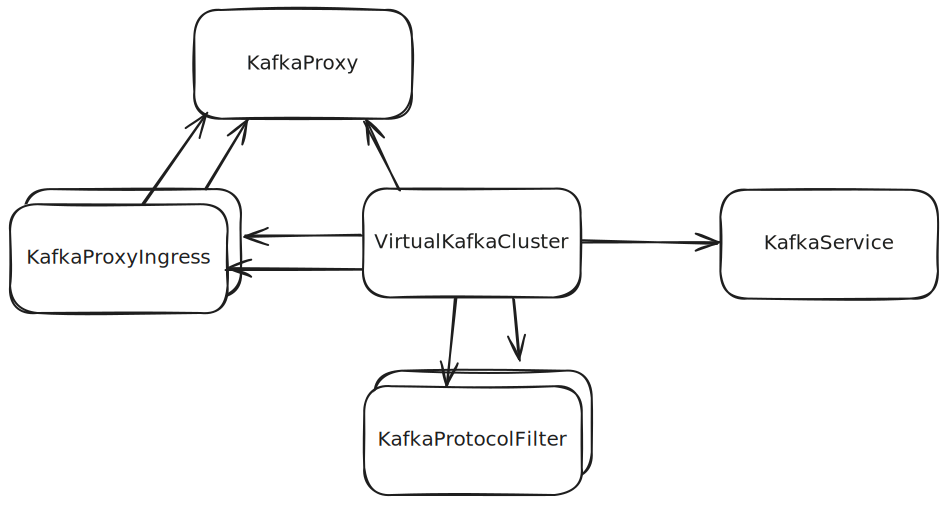

// file included in the following:
//
// kroxylicious-operator/index.adoc

[id='assembly-operator-api-{context}']
= API concepts

== API resources used by the Kroxylicious Proxy

The operator takes these custom resources and core Kubernetes resources as inputs:

`KafkaProxy`::
Defines an instance of the proxy.
`VirtualKafkaCluster`::
Represents a logical Kafka cluster that will be exposed to Kafka clients.
`KafkaProxyIngress`::
Configures how a virtual cluster is exposed on the network to Kafka clients.
`KafkaService`::
Specifies a _backend_ Kafka cluster for a virtual cluster.
`KafkaProtocolFilter`::
Specifies filter mechanisms for use with a virtual cluster.
`Secret`::
`KafkaService` and `KafkaProtocolFilter` resources may reference a `Secret` to provide security-sensitive data such as TLS certificates or passwords.
`ConfigMap`::
`KafkaService` and `KafkaProtocolFilter` resources may reference a `ConfigMap` to provide non-sensitive configuration such as trusted CA certificates.

.Example input resources, and the references between them.

Based on the input resources just described, the operator generates the core Kubernetes resources needed to deploy the Kroxylicious proxy, such as:

`ConfigMap`:: Provides the proxy configuration file mounted into the proxy container.
`Deployment`:: Manages the proxy `Pod` and container.
`Service`:: Exposes the proxy over the network to other workloads in the same Kubernetes cluster.

The API is decomposed into multiple custom resources in a similar way to the Kubernetes Gateway API, and for similar reasons.
You can make use of Kubernete's Role-Based Access Control (RBAC) to divide responsibility for different aspects of the overall proxy functionality to different roles (people) in your organization.

For example, you might grant networking engineers the ability to configure `KafkaProxy` and `KafkaProxyIngress`, while giving application developers the ability to configure `VirtualKafkaCluster`, `KafkaService`, and `KafkaProtocolFilter` resources.

.The generated Kubernetes resources, and the relationships between them
image::../_assets/operator-output-resource-topology.svg["Diagram showing the output resources, Deployment, Pod, ConfigMap, Service, with arrows showing the Deployment managing the Pod, the Pod mounting the ConfigMap, and the Service selecting the Pod."]

include::../modules/con-api-compatability-operator.adoc[leveloffset=+1]